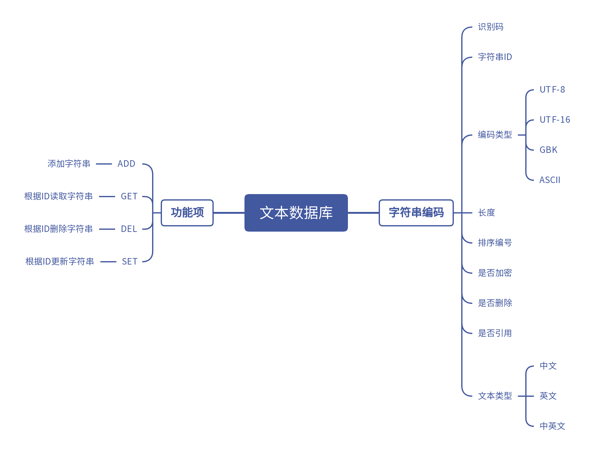

1. 题目：字符串与编码

2. 字符串：

   + 长度不固定：编码类型，字符个数
   + 编码类型多样化
   + 为什么需要编码规则

```shell
+----+----+----+----+----+----+----+----+----+
|  H |  e |  l |  l |  o |  , | 世 | 界 |  | |
+----+----+----+----+----+----+----+----+----+
|0x48|0x65|0x6C|0x6C|0x6F|0x2C|4E16|754C|0x21|
+----+----+----+----+----+----+----+----+----+

字节序列:
0x48 0x65 0x6C 0x6C 0x6F 0x2C 0x4E 0x16 0x75 0x4C 0x21

UTF-8编码:
0x48 0x65 0x6C 0x6C 0x6F 0x2C 0xE4 0xB8 0x96 0xE7 0x95 0x8C 0x21
```

3. 编码类型：

    + ASCII：1byte，首位为0，总共可以表示128个字符
    + GBK：国标码，包含两万多个汉字等字符
      + GBK编码兼容了ASCII字符集
      + GBK中用两个字节表示一个汉字，且第1个字节的第1位必须为1
    + Unicode：国际组织规定的统一编码，有很多编码方式
      + UTF-32：用4个字节表示一个字符，太过于浪费存储空间
      + UTF-16：使用2-4个字节存储编码
      + **UTF-8**：变长编码方案
        + 1字节：英文、数字等，第1位为`0b0`
        + 2字节：第1个字节前缀为`0b110`，第2个字节前缀为`0b10`
        + 3字节：汉字，第1个字节前缀为`0b1110`，第2、3个字节前缀为`0b10`
        + 4字节：第1个字节前缀为`0b11110`，第2、3、4个字节前缀为`0b10`

4. 编码过程

| Char | 世 | 界 |
|:---:|:---:|:---:|
| Unicode | 0x4E 0x16 | 0x75 0x4C |
| Binary | 0b0100_1110_0001_0110 | 0b0111_0101_0100_1100 |
| UTF-8 | 0xE4 0xB8 0x96 | 0xE7 0x95 0x8C |
| Binary | 0b1110_0100_1011_1000_1001_0110 | 0b1110_0111_1001_0101_1000_1100 |

5. `UTF-8`与`UTF-8 with BOM`：用于标识文件的编码类型

    + BOM：Byte Order Mark（字节序标记）
    + 两者区别：
      + UTF-8：`0xef 0xbb 0xbf`
      + UTF-16：
        + 大端模式：`0xfe 0xff`
        + 小端模式：`0xff 0xfe`
      + UTF-32：
        + 大端模式：`0x00 0x00 0xfe 0xff`
        + 小端模式：`0xff 0xfe 0x00 0x00`

6. 预告：手写文本数据库

